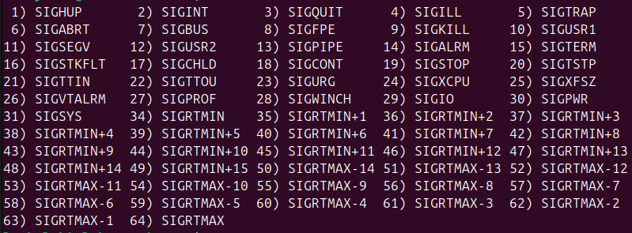

# Understand System Calls
## fork
The command 'fork' creates a new process by duplicating the calling process.
The calling process is called the parent and the new process is called the child process.

## stat
The command 'stat' is used to display a file status. Use the -f attribute to display the file system status

## kill
'kill' is used to send a signal to a process. The signals you can send are:


## mmap
The command 'mmap' is used to map or unmap files or devices into memory.

## chmod
'chmod' is used to change file mode bits on files. 
You can change who has access to the file and the rwx (read-write-execute) permisions

## waitpid
'waitpid' waits for a process to change state.

# System Call Fails
## fork
#### ENOMEM
fork() failed to allocate the necessary kernel structures because memory is tight.

#### ENOSYS
fork() is not supported on this plattform (for example, hardware without a Memory-Management unit).

## exec
#### EACCESS
If permission is denied for a file (the attempted execve(2) failed with the error EACCES)

#### ENOEXEC
If the header of a  file  isn't  recognized  (the  attempted  execve(2) failed  with the error ENOEXEC)

## unlink
#### ENOENT
File does not exist.

#### EACCESS
Permission denied.

#### EISDIR
Directory instead of file.

## read
#### EINTR
The call was interrupted by a singal before any data was read.

#### EIO
I/O  error.  This will happen for example when the process is in a background process group, tries to read from  its  controlling terminal,  and  either it is ignoring or blocking SIGTTIN or its process group is orphaned.  It may also occur when  there  is  a low-level  I/O  error while reading from a disk or tape.  A further possible cause of EIO on networked filesystems is  when  an advisory lock had been taken out on the file descriptor and this lock  has been lost.

#### EISDIR
The file descriptor 'fd' refers to a directory

## mount
#### ENODEV
Device or resource not found.

#### EINVAL
Invalid argument.

#### EACCESS
Permission denied.

#### Bugs
##### Crash
It is possible for a corrupted filesystem to cause a crash.

##### File mismatch (i don't really understand this one)
It is possible that the files /etc/mtab and /proc/mounts don’t match on systems with a regular mtab file. The first file is based only on the mount command options, but the content of the second file also depends on the kernel and others settings (e.g. on a remote NFS server — in certain cases the mount command may report unreliable information about an NFS mount point and the /proc/mount file usually contains more reliable information.) This is another reason to replace the mtab file with a symlink to the /proc/mounts file.

## chmod
#### ENOENT
File or Directory not found.

#### EROFS
File system is Read-Only.

#### ENOTSUP
Operation not supported.

## kill
#### ESRCH
No such process.

#### EPERM
Operation not permitted.

#### EAGAIN
Resource temporarily unavailable.

# Assembler
## Exercise
Rewrite the following C-Code into a Stack-based assembler program
```c
int x = 3;
int y = 4;
int z = 12;
int k = z * (x + y);
```

## Additional Info
- local variables start at address 32 of the local stack frame
- 32-bit architecture, i.e., an integer takes 4 bytes

## Solution
```asm
LA 0,32
LIT 3
STO

LA 0,36
LIT 4
STO

LA 0,40
LIT 12
STO

LA 0,44
LV 0,40
LV 0,32
LV 0,36
ADD
MUL
STO
```
