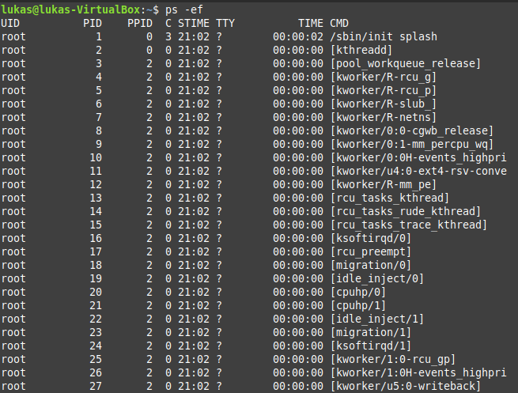
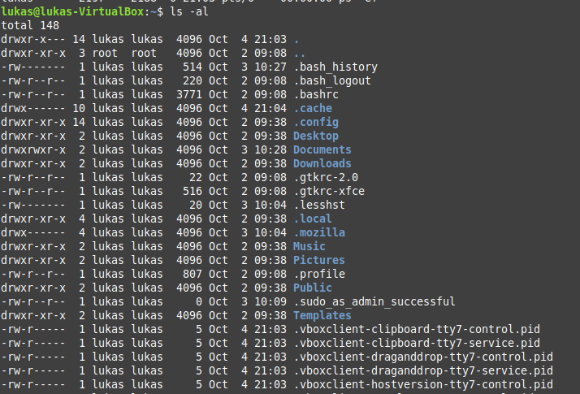

# ChromeOS

## Summary
ChromeOS is a Linux-based OS developed by Google. It's designed for web-based applications.

It's built on the open-source ChromiumOS project.

Most tasks are performed in the Chrome browser.

ChromeOS is a great tool for anyone who relies heavily on cloud services and needs a lightweight, efficient system.

## Interesting Features
### Android App Support
ChromeOS supports Android Apps from the Google Play Store. This greatly expands its functionality.

### Linux support
Since ChromeOS is based on Linux, it offers the ability to run Linux applications.

### Offline Features
ChromeOS integrated seamlessly with apps includes Google Docs and Gmail. This means, that those apps will even sync when you're offline.

# Linux Virtual Machine
I chose to install [Linux Mint](https://linuxmint.com/edition.php?id=31)

## Installation
Linux Mint was installed using Oracle Virtual Box. The installation process did not require documentation.

## Shell Commands
### ps -ef
This command lists all processes running on the system.

### ls -al
This command lists all files in the current directory.

### cd ~ + pwd
This command changes the directory to the home directory
