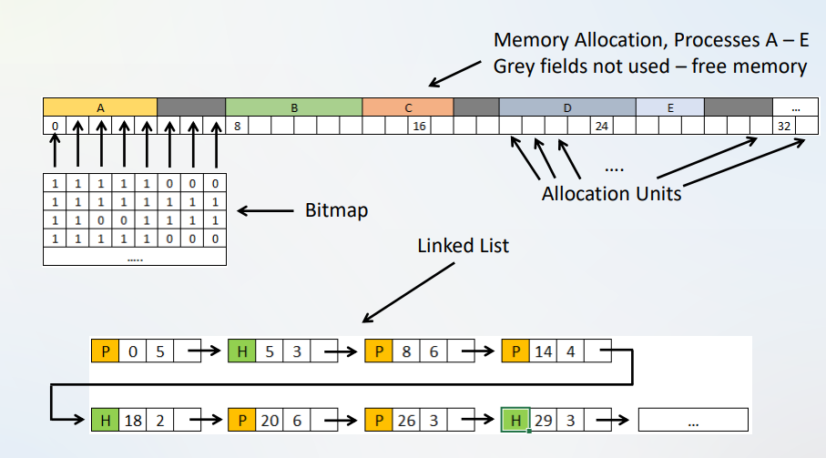

# Unit 07 - Memory Management: Exercises 02

## 1. Explain the principle of "static relocation" with your own words.

- **What problem does it solve?** It solves the issue, of having `jmp`-commands point to static addresses, which could **interfere with other programs**.
- **How does it do that?** Whenever a new Program is loaded, it analyzes all **jumps** and adds the start of the program in memory to the target address, effectively **relocating jumps when the programs is loaded**.

## 2. What problems will arise when using "static relocation"?

- Static relocation will **slown down the loading** of a program. While not really a problem, this is still worth mentioning.
- You need an indication, of **which addresses need to be relocated**.
- You can't easily move a program in memory, or more importantly **swap it out**. You would need to adjust the addresses every time you do a swap, which is just not feasible.

## 3. Explain with your own words: What is an address space?

An **address space** is just a part of memory that a process can use to address memory.
Every Process has its own address space and address spaces are **independant** from each other.

A real-life example of an address space are phone numbers. Every phone number in **Linz** starts with *+43 732 ...*, which is essentially an **adress space**.

## 4. Explain with your own words: What is the difference between static relocation and dynamic relocation?

With **static relocation** the adresses are relocated **when the program loads**, which is cumbersome and hard to maintain.
**Dynamic reloation**, on the other hand, adjusts the jump addresses **at runtime**.

A simple version of *dynamic relocation* can be implemented using **Base & Limit Registers**.
The **base register** stores the start of the Program in memory, whereas the **limit register** stores the length of the program.

When using this system, you can add the content of the base register, whenever you need to jump to an address, while also ensuring that you don't leave your address space using the limit register.

## 5. Explain with your own words: What is swapping?

**What do we do, when there is not enough space for every process we want to run (happens very often)?** We swap them!

Swapping works like this:
1. Bring in each process in its entirety
2. Run it for a while
3. Put it back on disk

We put the newly loaded process **wherever is free**, which we can only do efficiently because of **dynamic reloaction**.

## 6. What are typical problems of swapping?

- Swapping creates **holes in memory**
    - Usually, these holes are too small to fit processes in there.
    - We can solve this by performing a **memory campaction**, but this requires a lot of cpu time, so it is normally not done.
- Processes may need to grow
    - Processes can allocate new memory, but then they may **not fit in their address space anymore**
    - **What can we do?**
        - If possible, we can just **enlarge the address space** of the process.
        - If we can't do that, we could try to **find a bigger hole** to put the process in
        - or we can **swap it out to disk**

## 7. Which two principles do you know for managing free memory. Describe both in your own words.

We can manage free memory using **Bitmaps** or **Linked Lists**

In both principles we need to define **allocation units**. They can be any size from **a few words** up to **several kB**.
- **Small allocation units** mean more entries in our Bitmap or List, **increasing processing time**
- **Large allocation units** may **waste memory**, since processes do not fit exactly into them.

#### Bitmap

A bitmap is simply an **array**, where `0 = free unit` and `1 = allocated unit`.

The bitmap has a **fixed size**, meaning it's really simple, however **searching for free units is relatively slow**.

#### Linked List

They are typically **double linked lists**, with two possible entry types: `Hole (H)` and `Process (P)`.
They are **sorted by memory/unit address**.

If a process exits or is swapped out, **new free units** are merged into the list;
if a process is created or swapped in, **new allocated units** are entered to the list.

#### Comparison

In the figure below, you can see the comparison of **Bitmap** (above) and **Linked List** (below).

