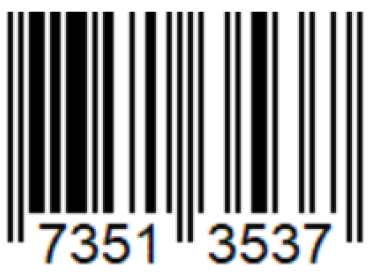

:sectnums:
:nofooter:
:toc: left
:icons: font
:data-uri:
:source-highlighter: highlightjs
:stem: latexmath

= Inh.04 -- Supermarket

We are processing products sold in a supermarket for its new online-shop offering
Unlike a traditional grocer, a supermarket offers not only food, but also non-food articles.

[cols="a,a",frame=none, grid=none]
|===
| image::pics/food.jpg[Food]
| image::pics/non-food.jpeg[Non-Food]
|===

== Products

Both food and non-food products share some common properties:

* A barcode
** Has to be a valid barcode, see <<validation,validation>>
* A product name
** Cannot be empty
* A stock quantity
** Must not be negative

Invalid values for barcode & product name are replaced by `"Invalid!"`, a negative quantity is set to `0`.

=== Barcode Validation[[validation]]

* All products have an https://en.wikipedia.org/wiki/EAN-8[EAN-8] barcode
** 
* It consists of 8 digits
** So no letters are allowed
** Shorter or longer EANs are not supported
* The last (eight) digit is a _check digit_ which is calculated from the first 7 digits
** Each digit is multiplied by a certain weight
*** A digit at an _even_ index has a weight of 3
*** A digit at an _uneven_ index has a weight of 1
** All _weighted_ digits are summed up
** Then the _difference_ of the _unit place_ to _the next multiple of ten_ is calculated
** This difference has to _match_ the check digit => then the barcode is valid

==== Example

* For the EAN 73513537
* => Check digit is 7

[cols="3h,7*"]
|===

|Position
|0
|1
|2
|3
|4
|5
|6

|Weight
|3
|1
|3
|1
|3
|1
|3

|EAN
|7
|3
|5
|1
|3
|5
|3

|Multiplication-Product
|21
|3
|15
|1
|9
|5
|9
|===

* Sum of all multiplication products is 63
* The next (bigger) multiple of ten is 70
* The difference between 70 and 63 is 7 => the check digit should be 7
** Actually, it is sufficient to subtract the unit place (_remainder_) from 10
* => This is a valid EAN-8 barcode

=== CSV Export

* All products are ready to be exported as CSV
* To support this task they have to provide two functions:
.. Provide a header with all individual column names
.. Turn the instance values into a CSV string

NOTE: The actual export to a file does _not_ have to be implemented this time -- but you should be able to do that, including proper path handling, without any problems by now!

==== `AppendToArray`

* This method is useful for tasks related to the CSV export capabilities
* It is a _generic_ method
** Despite only being called for `string` in this assignment 🙄
* Its job is to create a _new_ array which contains the content of the original array and (at the end) additional elements

=== Food

* Food products can contain various allergens
* The supermarket is legally required to list those to avoid life-threatening reactions for affected customers
* Those allergens are identified by a standardized code
** Already available in the `AllergenType` `enum`
** As defined by the Wirtschaftskammer Österreich (WKO)
* The list must not contain duplicates
* We need to offer a way of checking if any (one or more) specific allergen(s) is contained within the product
* No matter the order allergens are added or removed, they are always stored _in order_
** You are already _so very good_ at implementing sorting algorithms (😝) that we will use a proper one this time by utilizing a https://learn.microsoft.com/en-us/dotnet/api/system.collections.generic.sortedset-1[`SortedSet`]
*** Try to remember what we recently learnt about collections: why aren't we using a https://learn.microsoft.com/en-us/dotnet/api/system.collections.generic.sortedlist-2[`SortedList`] 🤔
* The list of allergens will be _encoded_ in the CSV string as _another_ CSV string using `'|'` as separator

=== Non-Food

* Non-food products can be reviewed by customers
* Each `Review` has the following properties:
** Date & Time it was posted
** A star-rating
*** As defined in the `Rating` `enum`
** A comment
* Based on all posted reviews an _average_ rating can be calculated

== Tasks

. Create a UML class diagram using PlantUML
. Complete the program by implementing all missing code pieces
** Look for `TODOs`
** Extensive unit tests have been provided
. Write all necessary XMLDoc comments
** Usually everything `public` & `protected` if _not_ inherited in a meaningful way

TIP: This assignment makes liberal use of the `params` feature -- if you can't remember what that is, https://learn.microsoft.com/en-us/dotnet/csharp/language-reference/keywords/params[check it out again]
