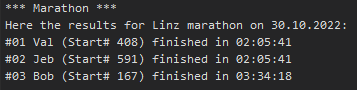

:sectnums:
:nofooter:
:toc: left
:icons: font
:data-uri:
:source-highlighter: highlightjs
:stem: latexmath

= Col.01 -- Marathon Results

This time you will create an application which manages results of a marathon run and converts those individual results into an _ordered_ list.

[plantuml,id=class_diagram]
----
@startuml

class Participant {
    +int StartNo [readonly]
    +string Name [readonly]
    +TimeSpan CompletionTime [readonly]
    
    +Participant(int, string, TimeSpan)
    +int CompareTo(Participant)
    +string ToString() [override]
}

class Marathon {
    -Node? _head;
    +string City [readonly]
    +DateOnly Date [readonly]
    +int ParticipantCount [private set]

    +Marathon(string, DateOnly)
    +void AddParticipant(Participant)
    +bool RemoveParticipant(int)
    +string[] GetResultList()
    +string ToString() [override]
}

Participant "n"-r-"0..1" Marathon: participates

@enduml
----

WARNING: As usual, you might have to initially comment some code to allow the application to compile.

== `Participant`

The participant is very simple and mostly just a data container.
Each instance represents one runner who completed the marathon (for simplicity we are not dealing with half-marathons and the like).

The two interesting bits are:

* `CompareTo`
** Compares two instances of the `Participant` class
** First completion times is compared, lower time means higher rank => comes earlier in the list
** If the completion time of two participants is the same compare the start number
*** Business rules dictate, that no two people can have the same start number
* `ToString`
** Has to follow the format `<NAME> (Start# <START_NO>) finished in <TIME>`
** Example: `Jeb (Start# 591) finished in 02:05:41`

== `Marathon`

The `Marathon` class organizes the results of the participants.
Internally, it is a _single linked list_.

Participants can be added to and removed from the marathon.

=== `Node`

As always with a linked list you need to implement a `Node` class.
It shows up in the <<class_diagram,class diagram>> as a field, but I have deliberately not provided the structure in the diagram -- by now you should be able to easily do that yourself.

TIP: Remember: this time we want a _single_ linked list.

=== Logic

Implement the following four methods and, as usual, check your implementation with the provided unit tests. 

==== `AddParticipant`

* Inserts a participant to the (internal) list
* Inserts happen *sorted*
** Use the `CompareTo` method of the participants to find the correct insert position
** Do _not_ implement a 'sort' method or something similar => during insert put the new node at the correct position already
*** That's a strength of a linked list, so we'll make use of it
* Increment the count

==== `RemoveParticipant`

* Removes the participant with the given start number from the list
* If none of the contained participants have this start number return `false`
* This operation does _not_ change the order in which the remaining items are stored
* Decrement the count _only_ if the operation succeeded

==== `GetResultList`

* Returns the _sorted_ list of marathon results
* This does _not_ require any sorting operation, because the values are already in the correct order within the list
* Each participant is turned into a string
** Prefixed by the rank (#1 first at the finish line, #n last at the finish line)
** Utilizing the `ToString` method of the participant
** Follows the format `#<RANK> <PARTICIPANT_INFO>`
*** Example: `\#03 Bob (Start# 167) finished in 03:34:18`
* If there are no participants an empty array is returned
* Does _not_ modify the list

==== `ToString`

* Returns a string representation of the marathon
** Follows the format `<CITY> marathon on <DATE>`
** Example: `Linz marathon on 30.10.2022`

== Sample Run

The `Program` class is already given.
Once you implemented the rest of the application correctly you should see the following output:

